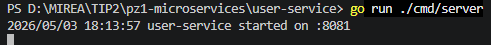
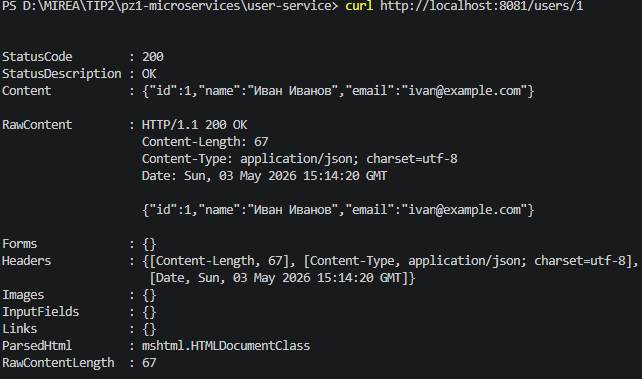
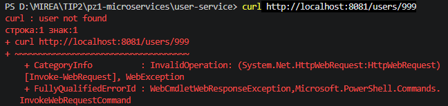
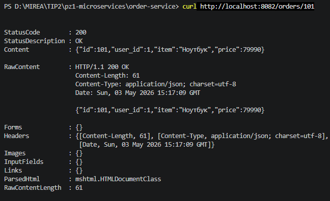
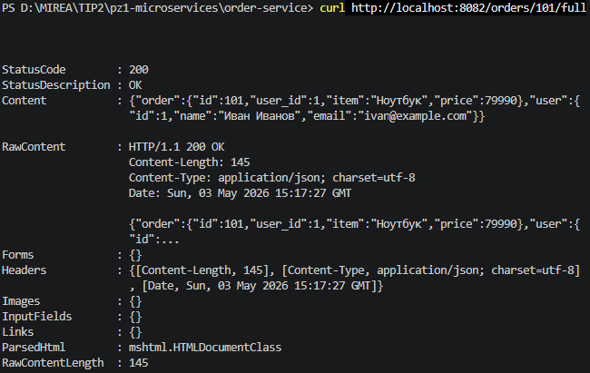
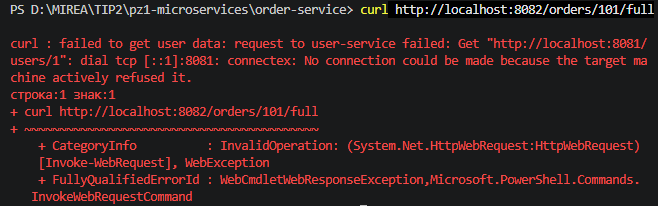
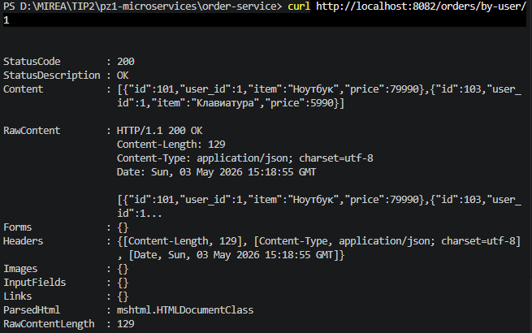

# Практическое занятие №1
# Разделение монолита на 2 микросервиса. Взаимодействие через HTTP

**Дисциплина:** Технологии индустриального программирования  
**Семестр:** 2, 2025-2026  
**Студент:** Буров М.А. ЭФМО-01-25

---

## Краткое описание проекта

Реализовано два независимых HTTP-микросервиса на языке Go, взаимодействующих по HTTP:

- **user-service** (порт 8081) – хранит и отдаёт информацию о пользователях.
- **order-service** (порт 8082) – хранит заказы. По запросу `/orders/{id}/full` обращается к `user-service`, получает данные пользователя и возвращает агрегированный ответ (заказ + пользователь). Также реализован маршрут `/orders/by-user/{userID}` для получения всех заказов конкретного пользователя.

Это демонстрирует переход от монолита к микросервисной архитектуре, где данные и код разделены между процессами, а взаимодействие происходит по сети.

---

## Структура проекта
pz1-microservices/
├── user-service/
│   ├── cmd/
│   │   └── server/
│   │       └── main.go
│   ├── internal/
│   │   └── user/
│   │       ├── model.go
│   │       ├── repo.go
│   │       └── handler.go
│   └── go.mod
└── order-service/
    ├── cmd/
    │   └── server/
    │       └── main.go
    ├── internal/
    │   └── order/
    │       ├── model.go
    │       ├── repo.go
    │       ├── handler.go
    │       └── client.go
    └── go.mod

---

## Требования к проекту

- Go 1.21+ (или актуальная версия)
- Два терминала для одновременного запуска сервисов
- Свободные порты 8081 и 8082
- Зависимости: только стандартная библиотека Go

---

## Результаты выполнения (скриншоты)

### Запуск user-service

### Проверка GET /users/1

### Проверка несуществующего пользователя (404)

### Запуск order-service

### Проверка обычного маршрута GET /orders/101

### Проверка агрегированного маршрута GET /orders/101/full

### Проверка ошибки при недоступном user-service (502)

### Дополнительное задание – список заказов пользователя GET /orders/by-user/1

---

## Ответы на контрольные вопросы

**1. Чем монолит отличается от микросервисной архитектуры?**  
Монолит – это единое приложение, в котором все функции собраны в одном процессе и запускаются как один сервер. Микросервисная архитектура состоит из набора независимых сервисов, каждый из которых отвечает за ограниченную бизнес-функцию, запускается, обновляется и масштабируется отдельно, а взаимодействие происходит по сети.

**2. Почему разделение системы на сервисы не всегда является лучшим решением?**  
Микросервисы дают гибкость, но усложняют инфраструктуру, тестирование, мониторинг, отладку и сетевое взаимодействие. Для небольших проектов монолит проще в разработке, запуске и отладке.

**3. Какую ответственность в этой работе несёт user-service, а какую — order-service?**  
user-service отвечает за хранение и предоставление информации о пользователях (по HTTP). order-service отвечает за хранение заказов и при необходимости обращается к user-service для получения данных о пользователе, чтобы собрать агрегированный ответ.

**4. Почему в микросервисной архитектуре важно обрабатывать таймауты и сетевые ошибки?**  
Потому что один сервис зависит от другого по сети. Если вызываемый сервис недоступен, медленно отвечает или возвращает некорректный ответ, это напрямую влияет на работу вызывающего сервиса. Таймауты и обработка ошибок позволяют избежать полной блокировки и предоставить осмысленный ответ (например, 502 Bad Gateway).

**5. Что означает статус 502 Bad Gateway в контексте взаимодействия сервисов?**  
Это означает, что сервис, выступающий в роли шлюза или прокси (в нашем случае order-service), не смог получить корректный ответ от вышестоящего сервиса (user-service). В нашем примере – когда user-service остановлен, order-service возвращает 502 Bad Gateway.

**6. Почему один сервис не должен напрямую обращаться к внутренним структурам кода другого сервиса?**  
Потому что в микросервисной архитектуре сервисы независимы. order-service не имеет прямого доступа к коду user-service, он обращается к нему по сети через HTTP API. Это гарантирует изоляцию, позволяет менять реализацию одного сервиса, не затрагивая другой, но требует чётко определённого контракта (API).

**7. Какие преимущества даёт разделение на сервисы при росте проекта?**  
Разные части приложения можно развивать с разной скоростью, независимо выкатывать обновления, распределять нагрузку, выделять особенно нагруженные или критичные блоки для отдельного масштабирования. Отдельные команды могут работать над разными сервисами без конфликтов в общем коде.

**8. Какие новые сложности появляются после такого разделения?**  
Усложняется инфраструктура (запуск нескольких процессов, сетевое взаимодействие), тестирование, мониторинг и отладка. Разработчику приходится контролировать сетевые ошибки, таймауты, адреса сервисов, проектировать API между сервисами и учитывать, что отказ одного компонента может повлиять на другой.